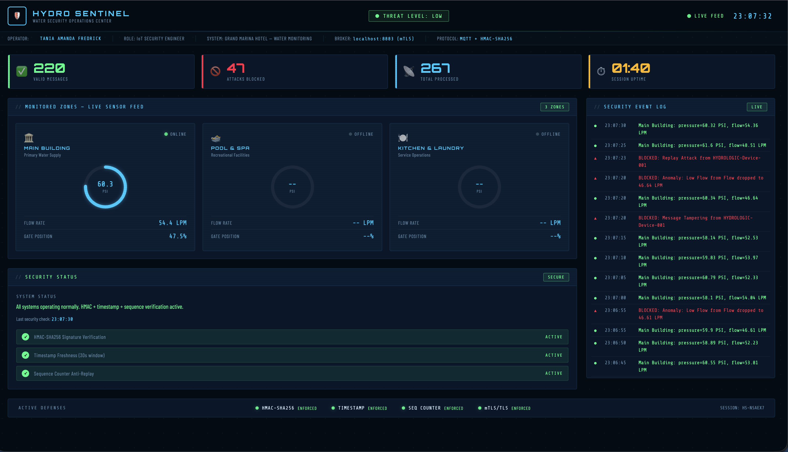
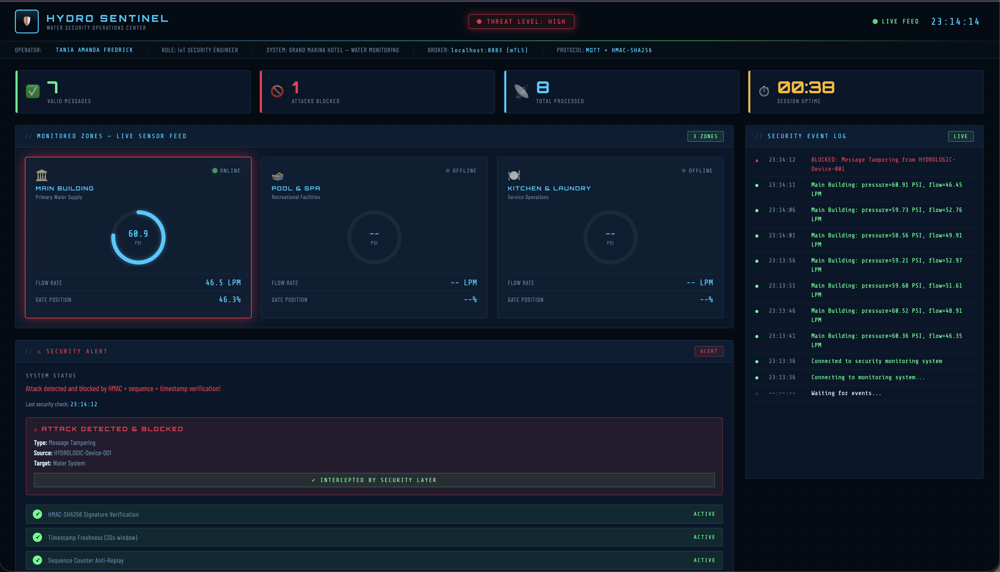
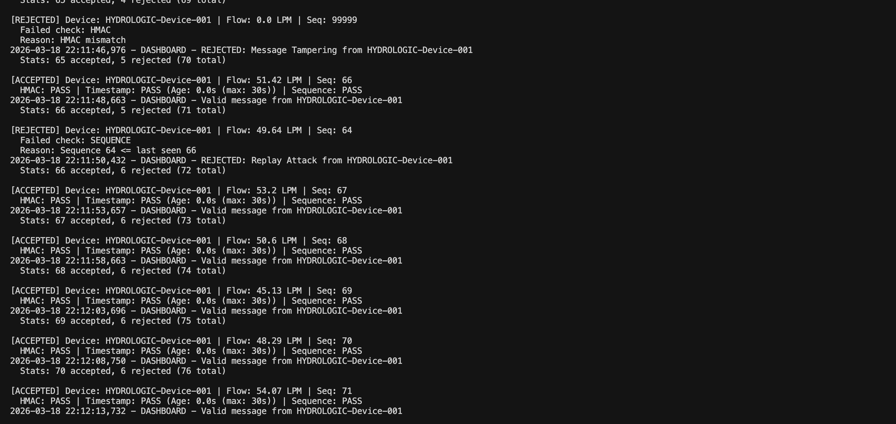
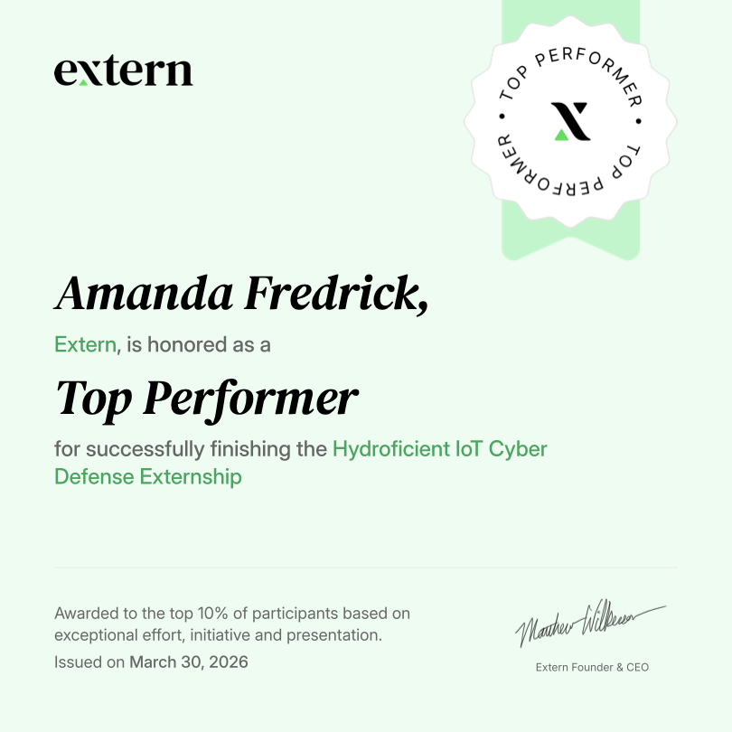

# 🛡 IoT Cyber Defense System

A secure IoT telemetry and monitoring system designed to simulate and defend against real-world cyber attacks, including replay attacks, data injection, and eavesdropping.

This project progressively hardens an MQTT-based IoT pipeline using TLS/mTLS, rule-based defenses, and AI-powered anomaly detection.

---

## 🚀 Key Features

- Secure MQTT communication using **TLS and mutual TLS (mTLS)**
- Replay attack detection using **timestamps and sequence counters**
- Message integrity validation using **HMAC-SHA256**
- Simulation of real-world attacks:
  - Replay attacks (immediate and delayed)
  - Data injection
  - Unauthorized subscription (eavesdropping)
- Real-time monitoring dashboard:
  - ✅ Normal traffic (green)
  - 🚫 Blocked attacks (red)
  - ⚠️ Anomalies (orange)
- AI-enhanced anomaly detection for identifying suspicious telemetry patterns

---

## 🧠 Project Summary

Designed and implemented a secure IoT communication system using MQTT, TLS/mTLS, HMAC validation, timestamp verification, and sequence counters.

Simulated multiple attack scenarios and developed layered defenses to detect and prevent malicious activity. Built a real-time dashboard and integrated AI-based anomaly detection for enhanced system monitoring.

---

## 🧱 System Architecture

The system simulates IoT devices sending telemetry data through an MQTT broker while enforcing layered security checks:

- **Publisher** -> Simulated IoT device sending data
- **Broker (Mosquitto)** -> Handles MQTT communication
- **Subscriber** -> Validates messages and detects attacks
- **Dashboard** -> Displays system activity and alerts
- **Attack Simulator** -> Injects malicious scenarios

---

## ⚔️ Attack Scenarios

- **Replay Attacks**
  - Immediate replay
  - Delayed replay
- **Data Injection**
  - Fake messages with invalid HMAC
- **Eavesdropping**
  - Unauthorized subscription to MQTT topics

---

## 🛡 Defense Mechanisms

- **HMAC Validation**  
  Ensures message authenticity and integrity

- **Timestamp Verification**  
  Rejects stale or delayed messages

- **Sequence Counters**  
  Prevents replay attacks by enforcing message order

- **TLS / mTLS**  
  Encrypts communication and enforces device authentication

---

## 🤖 AI Anomaly Detection

Integrated machine learning techniques to detect abnormal telemetry patterns that bypass rule-based defenses.

Used anomaly detection models to:
- Identify unusual pressure/flow patterns
- Flag suspicious but valid-looking data
- Enhance system visibility beyond static rules

---

## 📊 Dashboard Preview

Add these files to the `screenshots/` folder:

- `dashboard-overview.png`
- `attack-detection.png`
- `terminal-logs.png`

Then they will render automatically here:

### Dashboard Overview


### Attack Detection


### Terminal Logs


---

## ⚙️ Tech Stack

- **Python**
- **MQTT (Mosquitto)**
- **TLS / mTLS**
- **Cryptography (HMAC-SHA256)**
- **Scikit-learn (Anomaly Detection)**
- **WebSockets / Dashboard UI**

---

## ▶️ How to Run

1. Install dependencies:

```bash
pip install -r requirements.txt
```

2. Start the MQTT broker:

```bash
mosquitto -c mosquitto_mtls.conf -v
```

3. Run the publisher:

```bash
python publisher_defended.py
```

4. Run the subscriber/dashboard:

```bash
python subscriber_dashboard_ai.py
```

5. Launch attack simulations:

```bash
python attack_simulator.py
```

6. View dashboard:

```
http://localhost:8000
```

---

## 📌 Future Improvements

- Deploy system on cloud infrastructure
- Scale to multiple IoT devices
- Improve real-time anomaly detection models
- Integrate reinforcement learning for adaptive defense

---

## 🏆 Recognition

Awarded **Top Performer (Top 10%)** in the Hydroficient IoT Cyber Defense Externship for exceptional performance and project execution.

[View Full Certificate (PDF)](./certificate_54067.pdf)



---

## 👩🏽‍💻 Author

Tania-Amanda Fredrick  
Frontend Engineer | AI & Cybersecurity Researcher
